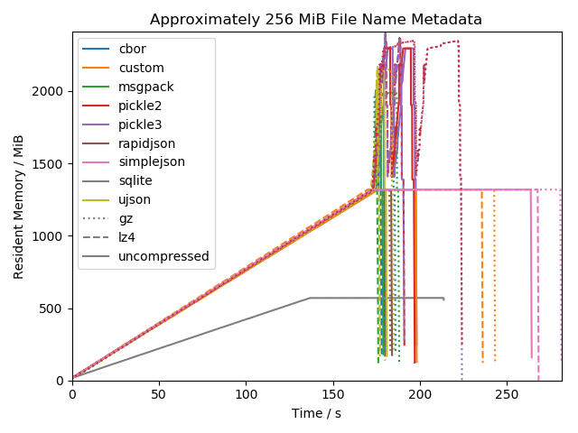
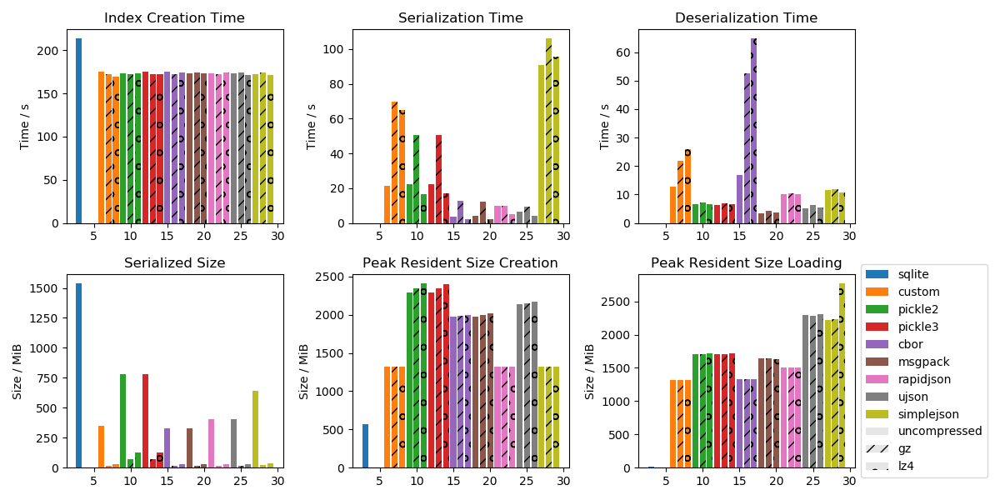

# Random Access Read-Only Tar Mount (Ratarmount)

Combines the random access indexing idea from [tarindexer](https://github.com/devsnd/tarindexer) and then **mounts** the tar using [fusepy](https://github.com/fusepy/fusepy) for easy read-only access just like [archivemount](https://github.com/cybernoid/archivemount/). 
It also will mount TARs inside TARs inside TARs, ... **recursively** into folders of the same name, which is useful for the ImageNet data set.
Furthermore, it now has support for **BZip2** compressed TAR archives!


# Installation

You can simply install it from PyPI:
```
pip install ratarmount
```

Or, if you want to test the latest devlopment version on a Debian-like system:
```bash
sudo apt-get update
sudo apt-get install python3 python3-pip git
git clone https://github.com/mxmlnkn/ratarmount.git
python3 -m pip install --user .
ratarmount --help
```

# Usage

```
usage: ratarmount.py [-h] [-f] [-d DEBUG] [-c] [-r] [-s SERIALIZATION_BACKEND]
                     [-p PREFIX] [--fuse FUSE]
                     tar-file-path [mount-path]

If no mount path is specified, then the tar will be mounted to a folder of the
same name but without a file extension. TAR files contained inside the tar and
even TARs in TARs in TARs will be mounted recursively at folders of the same
name barred the file extension '.tar'. In order to reduce the mounting time,
the created index for random access to files inside the tar will be saved to
<path to tar>.index.<backend>[.<compression]. If it can't be saved there, it
will be saved in ~/.ratarmount/<path to tar: '/' ->
'_'>.index.<backend>[.<compression].

positional arguments:
  tar-file-path         The path to the TAR archive to be mounted.
  mount-path            The path to a folder to mount the TAR contents into.
                        (default: None)

optional arguments:
  -h, --help            show this help message and exit
  -f, --foreground      Keeps the python program in foreground so it can print
                        debug output when the mounted path is accessed.
                        (default: False)
  -d DEBUG, --debug DEBUG
                        Sets the debugging level. Higher means more output.
                        Currently, 3 is the highest. (default: 1)
  -c, --recreate-index  If specified, pre-existing .index files will be
                        deleted and newly created. (default: False)
  -r, --recursive       Mount TAR archives inside the mounted TAR recursively.
                        Note that this only has an effect when creating an
                        index. If an index already exists, then this option
                        will be effectively ignored. Recreate the index if you
                        want change the recursive mounting policy anyways.
                        (default: False)
  -s SERIALIZATION_BACKEND, --serialization-backend SERIALIZATION_BACKEND
                        Specify which library to use for writing out the TAR
                        index. Supported keywords: (none,pickle,pickle2,pickle
                        3,custom,cbor,msgpack,rapidjson,ujson,simplejson,sqlit
                        e)[.(lz4,gz)] (default: sqlite)
  -p PREFIX, --prefix PREFIX
                        The specified path to the folder inside the TAR will
                        be mounted to root. This can be useful when the
                        archive as created with absolute paths. E.g., for an
                        archive created with `tar -P cf
                        /var/log/apt/history.log`, -p /var/log/apt/ can be
                        specified so that the mount target directory
                        >directly< contains history.log. (default: )
  --fuse FUSE           Comma separated FUSE options. See "man mount.fuse" for
                        help. Example: --fuse
                        "allow_other,entry_timeout=2.8,gid=0". (default: )
```

Index files are if possible created to / if existing loaded from these file locations in order:

  - `<path to tar>.index.pickle`
  - `~/.tarmount/<path to tar: '/' -> '_'>.index.pickle`


# The Problem

You downloaded a large TAR file from the internet, for example the [1.31TB](http://academictorrents.com/details/564a77c1e1119da199ff32622a1609431b9f1c47) large [ImageNet](http://image-net.org/), and you now want to use it but lack the space, time, or a file system fast enough to extract all the 14.2 million image files.


## Partial Solutions

### Archivemount

Archivemount[https://github.com/cybernoid/archivemount/] does not seem to support random access in version 0.8.7 and also mounting seems to have performance issues:

  - Mounting the 6.5GB ImageNet Large-Scale Visual Recognition Challenge 2012 validation data set, and then testing the speed with: `time cat mounted/ILSVRC2012_val_00049975.JPEG | wc -c` takes 250ms for archivemount and 2ms for ratarmount.
  - Trying to mount the 150GB [ILSVRC object localization data set](https://www.kaggle.com/c/imagenet-object-localization-challenge) containing 2 million images was given up upon after 2 hours. Ratarmount takes ~15min to create a ~150MB index and <1ms for opening an already created index (SQLite database) and mounting the TAR. In contrast, archivemount will take the same amount of time even for subsequent mounts.

### Tarindexer

[Tarindex](https://github.com/devsnd/tarindexer) is a command line to tool written in Python which can create index files and then use the index file to extract single files from the tar fast. However, it also has some caveats which ratarmount tries to solve:

  - It only works with single files, meaning it would be necessary to loop over the extract-call. But this would require loading the possibly quite large tar index file into memory each time. For example for ImageNet, the resulting index file is hundreds of MB large. Also, extracting directories will be a hassle.
  - It's difficult to integrate tarindexer into other production environments. Ratarmount instead uses FUSE to mount the TAR as a folder readable by any other programs requiring access to the contained data.
  - Can't handle TARs recursively. In order to extract files inside a TAR which itself is inside a TAR, the packed TAR first needs to be extracted.


### TAR Browser

I didn't find out about [TAR Browser](https://github.com/tomorrow-nf/tar-as-filesystem/) before I finished the ratarmount script. That's also one of it's cons:

  - Hard to find. I don't seem to be the only one who has trouble finding it as it has zero stars on Github after 4 years compared to 29 stars for tarindexer after roughly the same amount of time.
  - Hassle to set up. Needs compilation and I gave up when I was instructed to set up a MySQL database for it to use. Confusingly, the setup instructions are not on its Github but [here](https://web.wpi.edu/Pubs/E-project/Available/E-project-030615-133259/unrestricted/TARBrowserFinal.pdf).
  - Doesn't seem to support recursive TAR mounting. I didn't test it because of the MysQL dependency but the code does not seem to have logic for recursive mounting.

Pros:
  - supports bz2- and xz-compressed TAR archives


## The Solution

Ratarmount creates an index file with file names, ownership, permission flags, and offset information to be stored at the TAR file's location or inside `~/.ratarmount/` and then offers a FUSE mount integration for easy access to the files.

The test with the first version (50e8dbb), which used pickle serialization, for the ImageNet data set is promising:

  - TAR size: 1.31TB
  - Contains TARs: yes
  - Files in TAR: ~26 000
  - Files in TAR (including recursively in contained TARs): 14.2 million
  - Index creation (first mounting): 4 hours
  - Index size: 1GB
  - Index loading (subsequent mounting): 80s
  - Reading a 40kB file: 100ms (first time) and 4ms (subsequent times)

The reading time for a small file simply verifies the random access by using file seek to be working. The difference between the first read and subsequent reads is not because of ratarmount but because of operating system and file system caches.

Here is a more recent test for version 0.2.0 with the new default SQLite backend:

  - TAR size: 124GB
  - Contains TARs: yes
  - Files in TAR: 1000
  - Files in TAR (including recursively in contained TARs): 1.26 million
  - Index creation (first mounting): 15m 39s
  - Index size: 146MB
  - Index loading (subsequent mounting): 0.000s
  - Reading a 64kB file: ~4ms
  - Running 'find mountPoint -type f | wc -l' (1.26M stat calls): 1m 50s


## Choice of the Serialization for the Index File

For most conventional TAR files, which have less than than 10k files, the choice of the serialization backend does not matter.
However, for larger TARs, both the runtime and the memory footprint can become limiting factors.
For that reason, I tried different methods for serialization (or marshalling) the database of file stats and offsets inside the TAR file.

To compare the backends, index creation and index loading was benchmarked.
The test TAR for the benchmark contains 256 TARs containing each roughly 11k files with file names each of length 96 characters.
This amounts to roughly 256 MiB of metadata in 700 000 files.
The size of the files inside the TAR do not matter for the benchmark.
Therefore, they are zero.



Above is a memory footprint timeline for index creation.
The first 3min is the same for all except sqlite as the index is created in memory.
The SQLite version differs as the index is not a nested dictionary but is directly created in the SQL table.
Then, there is a peak, which doubles the memory footprint for most serialization backends except for 'custom' and 'simplejson'.
This is presumably because most of the backends are not streaming, i.e, the store a full copy of the data in memory before writing it to file!
The SQLite version is configured with a 512MiB cache, therefore as can be seen in the plot after that cache size is reached, the data is written to disk periodically meaning the memory footprint does not scale with the number of files inside the TAR!

The timeline for index loading is similar.
Some do need twice the amount of memory, some do not.
Some are slower, some are faster, SQLite is the fastest with practically zero loading time.
Below is a comparison of the extracted performance metrics like maximum memory footprint over the whole timeline or the serialization time required.




### Conclusion

Use the **SQLite** backend.

When low on disk memory, which shouldn't be the case as you already have a huge TAR file and the index is most often only ~0.1% of the original TAR file's size, use the **lz4 compressed msgpack** backend.
